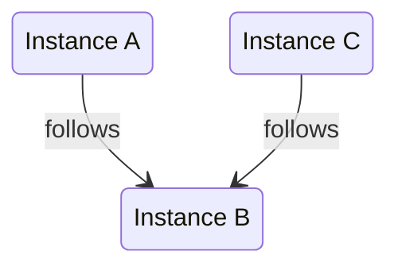
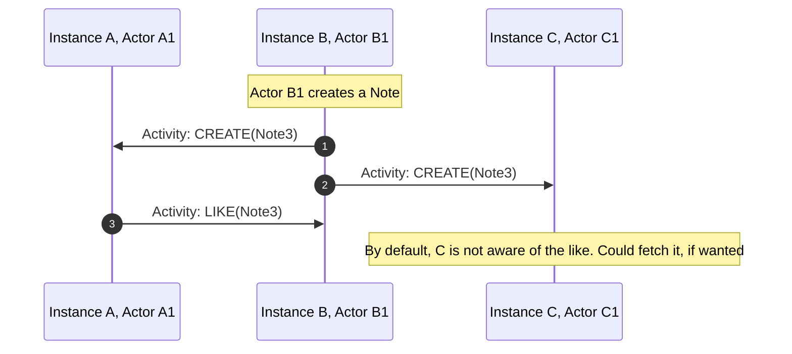
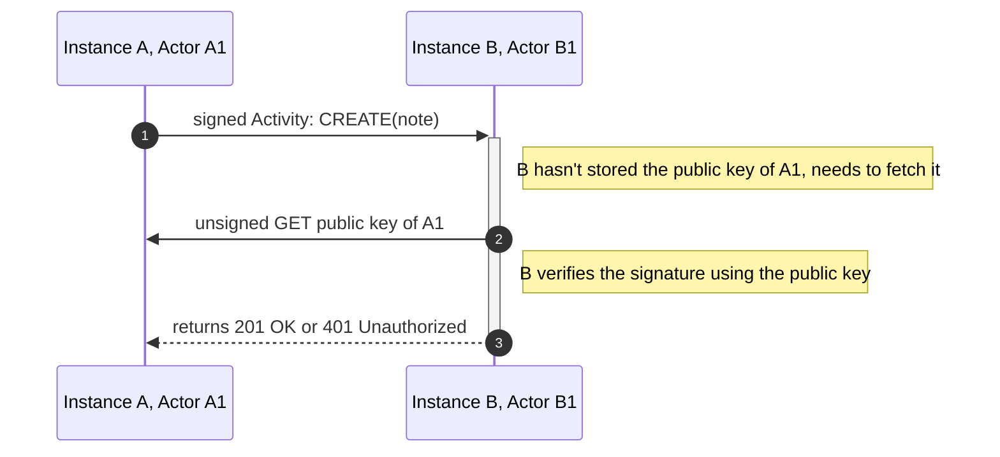

# Abusing ActivityPub to federate game servers

## A deeper look into what powers the Social Web.

<div class="absolute bottom-10">
  <span class="font-700">
   iu.tech 2024
  </span>
</div>

<div class="absolute bottom-10 right-5">
  <span class="font-700">
   .
  </span>
</div>

---
layout: intro
---

# Abusing ActivityPub to federate game servers

## A deeper look into what powers the Social Web.

<div class="absolute bottom-10">
  <span class="font-700">
   iu.tech 2024
  </span>
</div>


---
layout: intro-image-right

image: /images/basti.png
---

# Who am I?
<br>

## Sebastian Di Luzio
- Senior Software Engineer <br>in Team Foundation (EduTech)
- Joined IU end of 2021
- Spend far too much of my free time on side projects

---

# We will talk about

- The Fediverse
- Overview of the example game
- Overview of ActivityPub
- Making the game work with ActivityPub

<!--
We will talk about the Fediverse in general.

I'll give you an overview of the example game we're looking at for this talk

We will dive into ActivityPub itself

And we will find out how to federate the example gaming using ActivityPub
-->

---
layout: intro-image-right
image: /images/fediverse-logo.png
---

# The Fediverse
Also known as "The Social Web"


A giant Network of social media services federated by ActivityPub


<!--
So, what is The Fediverse?

The Fediverse -> Social Web

On the right side, you can see the logo of the Fediverse

giant network of social media services
-->

---
layout: intro-image-right

image: /images/fediverse-v1.2.png
---

# Fediverse: Overview

- Federated: Platforms are independent but can interact with eachother.
- Users can interact with users of any platform.
- powered by ActivityPub

<!--
Federation: platforms independent, but can interact with eachother

This also means that users can interact with users of any platform that is part of the Fediverse

right side: diagram of the Fediverse, showing different platforms that exist

examples:
- Mastodon, which is a microblogging platform similar to Twitter
- Pixelfed, which is a image sharing platform similar to Instagram
- PeerTube, which is a video sharing platform similar to YouTube
-->

---

I thought to myself

# Huh, that sounds cool.

<div v-click>

# I want to build something based on this!
</div>

<!--
After encountering the Fediverse the first time, I thought to myself:

Huh, that sounds cool.

I want to build something based on this!

And what I ended up building, was a game.
-->
---

# The premise of the game

<v-clicks>

- Your task is to build up your village
- You need resources to build
- You can generate specific resources based on your occupation
  - e.g. a miner generates stone, coal, iron, etc.
- To progress you also need resources you can't generate yourself
- You can trade with other players to get those resources

</v-clicks>
<div v-click>

## Through Federation ✨
</div>

<!--
The premise of the game is quite simple:

Your task is to build up your village

And you need resources to do so

You can only generate specific resources based on your occupation, so e.g. if you're a miner, you can generate stone, coal, iron, and similar resources

But, to progress in the game, you will also need resources you can't generate yourself

And that's where trading comes in: You can trade with other players to get those resources


The twist is that this happens across multiple servers, and works through Federation
-->

---
layout: intro-image-right
image: /images/gameplay/0_resources.png
---
# We're a miner.
We generate stone, but no wood.

<!--
Let's look at an example gameplay flow of trading resources between two instances


In this case, we're a miner.

We generate stone, but no wood or leather. We have zero wood and zero leather, but 124 thousand stone available.

For the next upgrade, we need 500 wood, so we want to trade for that.

-->

---
layout: intro-image-right
image: /images/gameplay/1_propose-treaty.png
---
# To start trading, we need to sign a treaty.
We can propose a treaty to a game server we trust.

<!--
But before we can start trading, we need to sign a treaty with another server.

Treaties are a way to agree on mututal trading with a trusted server.

In our case, we know a friend who can generate wood on the test.game.diluz.io server, which we will ask for a treaty

-->

---
layout: intro-image-right
image: /images/gameplay/2_accepted-treaty.png
---
# The other server accepted the treaty.
We allow trades to and from this server.

<!--
Once the other server accepted the treaty, we can see a treaty in our list that has the status "signed"

This means we have agreed on trading with eachother, and will send and receive trades to and from this server

-->

---
layout: intro-image-right
image: /images/gameplay/3_propose-trade.png
---
# We propose a trade.
We want wood and can give stone in return.

<!--
Since we need wood, we propose a trade where we request 500 wood and offer 600 stone in return

We submit this trade, and all servers that have a treaty with us will see this trade

Once another server receives it, they can choose to accept the trade
-->

---
layout: intro-image-right
image: /images/gameplay/6_received-trade-result.png
---
# Another instance accepts our offer.
We now have wood!

<!--
In our case, the trade was accepted, and we now have 500 wood available in addition to the stone we already had!

We can now use this wood to further upgrade our village
-->

---

# Ok, we know the basics of the game
<br>

## How do we make this part of the Fediverse?

<!--
Okay, now we know the basics of the cooperative part of the game

How does this fit into the Fediverse though? It's not like we're a social media platform
-->

---

# First, we need to understand ActivityPub
<br>

## It's a W3C standard, finalized in 2018
> W3C is the World Wide Web Consortium
> 
> They define things like: HTML, CSS, XML, WebAssembly, WebRTC, ...

<br>

<v-click>

## It also:
- Defines an open federation protocol
- Defines a client-server API
- Defines federated server-to-server API
- Is based on ActivityStreams

</v-click>

<!--
Well, first we need to understand how the Fediverse works under the hood.

It's powered by ActivityPub, so we need to understand what that is

First and foremost ActivityPub is a W3C standard which was finalized in 2018

For those of you who don't know, the W3C is the World Wide Web Consortium, which defines and maintains standards like HTML, CSS, XML, WebAssembly, WebRTC, and many more

And ActivityPub is one of those standards

It defines an open federation protocol

It defines a client to server API

But it also defines a federated server to server API, which is what's most interesting to us

And it is, under the hood, based on ActivityStreams

Now, this raises the question: What are ActivityStreams?
-->

---

# ActivityStreams (2.0)

- Also a W3C standard
- Specifies underlying schemas used in ActivityPub
- is implemented as JSON-LD

<!--
ActivityStreams is also a W3C standard

It specifies the underlying schemas that are used in ActivityPub

And it is implemented as JSON-LD


Oh come on. What's JSON-LD now?
-->

---

# JSON-LD

<br>

## JSON for Linking Data

- a W3C standard
- lightweight Linked Data format
<v-click>

## Linked Data
A way to create a network of standards-based, machine-readable data across Web sites
</v-click>

<!--
JSON-LD is JSON for Linking Data

It's a W3C standard, and a lightweight Linked Data format


Linked Data is a way to create a network of standards-based, machine-readable data across Web sites by linking data to eachother


This sounds super complex, so let's look at an example to make this less abstract
-->

---
layout: two-cols-header
---
# JSON-LD Example

::left::

Example JSON-LD object:


```json {|4-5|6-9|2-3}
{
  "@context": 
    "https://json-ld.org/contexts/person.jsonld",
  "@id": 
    "http://dbpedia.org/resource/John_Lennon",
  "name": "John Lennon",
  "born": "1940-10-09",
  "spouse": 
    "http://dbpedia.org/resource/Cynthia_Lennon"
}
```

::right::

<v-click at="3">

https://json-ld.org/contexts/person.jsonld:
```json {|5-15}
{
  "@context": {
      "Person": "http://xmlns.com/foaf/0.1/Person",
      "xsd": "http://www.w3.org/2001/XMLSchema#",
      "name": "http://xmlns.com/foaf/0.1/name",
      "born":
      {
         "@id": "http://schema.org/birthDate",
         "@type": "xsd:date"
      },
      "spouse":
      {
         "@id": "http://schema.org/spouse",
         "@type": "@id"
      },
   }
}
```

</v-click>

<!--
Here we have an JSON-LD object that represents the person John Lennon

It has an ID which is a link that will return the object we're looking at

It also has a name, a birthdate, and a spouse

Looking at the spouse, it is again a link to an object, which is a good example of how Linked Data works

Looking at the context, we see another link: If points to the JSON-LD object on the right.

The context defines the schema that is used in the JSON-LD object,
and we can see that when we look at the name, born, and spouse properties of it,
which describe exactly what we saw earlier in the john lennon object


Now that we have a rough idea of JSON-LD, let's look at ActivityStreams again
-->

---

# ActivityStreams: General context

```json
{
  "@context": "https://www.w3.org/ns/activitystreams",
  ...
}
```

- Activities
- Notes
- Actors
- Collections
- ...

<!--
ActivityStreams defines an Object

The object can have many different types, and encompasses almost everything that exists within ActivityStreams

These types include things like Activities, Notes, Actors, Collections, and a few more

Let's go through the most important ones, starting with Activities

-->

---

# ActivityStreams: Activity

Represents an action that has taken place

```json
{
  "@context": "https://www.w3.org/ns/activitystreams",
  "id": "http://example.org/activities/1",
  "type": "Create", // Update, Delete, Follow, Like, Accept
  "actor": "http://example.org/actors/1",
  "object": "http://example.org/notes/1",
}
```

<!--
ActivityStreams activities represent an action that has taken place

In this example, we can see the activitystreams context, which will be part of all activitystreams objects

We see an ID which points to the activity itself

The type of the activity is "Create", which means that a new object has been created

But the type can also be "Update", "Delete", "Follow", "Like" or "Accept"

The actor is the one who performed the action, and the object is the object that the action was performed on.

So, in this example, the actor created a new note, and the object links to that note.

Let's talk about notes then!
-->

---

# ActivityStreams: Note

They are what you would call a "post" on a social media platform

```json
{
  "@context": "https://www.w3.org/ns/activitystreams",
  "id": "http://example.org/notes/1",
  "type": "Note",
  "content": "Hello world!",
  "attributedTo": "http://example.org/actors/1",
  ...
}
```

<!--
Notes are what you would call a "post" on a social media platform

They contain content you want to share with other users

Again, we have the activitystreams context, the ID of the note, and the type, which is "Note"

We also have the content of the note, which in this case is "Hello world!"

And we have the attributedTo property, which links to the actor that owns the note

Speaking about actors, let's look at them next
-->
---

# ActivityStreams: Actor


Represents a "User"

```json
{
  "@context": "https://www.w3.org/ns/activitystreams",
  "id": "http://example.org/actors/1",
  "type": "Person", // Application, Group, Organization, Service
  "name": "sebastian.di-luzio",
  "preferredUsername": "Basti",
  "inbox": "http://example.org/actors/1/inbox",
  "outbox": "http://example.org/actors/1/outbox",
  ...
}
```

<!--
An actor represents a "User" in the Fediverse

There can be one actor per server, or many per server

The object has the activitystreams context, an ID, and the type, which is "Person" in this case

They can be a person, but also an application, a group, an organization, or a service. E.g. applications and services would be marked as bot users in some platforms, while groups and organizations imply that there is more than one user behind the actor


They also have a name and a preferred username which is used in UIs

And most importantly, an inbox and an outbox
-->

---

# Inbox/Outbox


- Inbox: where activities are sent to
- Outbox: where activities can be retrieved from
- They are `OrderedCollection`s

<!--
As the name implies, the inbox is where activities are sent to.

If you want to send an activity to another actor, you would send it to their inbox

The outbox is where activities can be retrieved from

If you want to fetch the activities of another actor, you would fetch them from their outbox

Both the inbox and the outbox are `OrderedCollection`s
-->
---

# ActivityStreams: (Ordered) Collections

Outbox: 

```json
{
  "@context": "https://www.w3.org/ns/activitystreams",
  "summary": "Basti's activity feed",
  "type": "OrderedCollection",
  "totalItems": 2,
  "orderedItems": [
    {
      "id": "http://example.org/activity/42",
      "type": "Create",
      "object": "http://example.org/notes/7",
      ...
    },
    {
      "id": "http://example.org/activity/1",
      "type": "Create",
      "object": "http://example.org/notes/1",
      ...
    }
  ]
}
```

<!--
OrderedCollections are - in this case - chronologically ordered lists of activities

They contain meta information like the total number of items in the collection, and of course the items themselves

In this example, we see an OrderedCollection that represents Basti's activity feed, which contains two CREATE activities


Now that we have a rough idea of what ActivityStreams is, let's look at ActivityPub, and an example flow of activities between instances
-->

---
layout: default
transition: none
---

# Example: Note Creation & Like Federation


Our Instance `B` is being followed by instances `A` and `C`

<br>



<!--
In this example, we are on instance B

We are being followed by instances A and C

-->

---
layout: default
---

# Example: Note Creation & Like Federation



<!--
If we now create a note on instance B, this note will be sent to instance A and instance C

This way, they are aware of the existence of the note

If and actor on instance A likes the note, it will send a LIKE activity to instance B, so that we are aware of the like as well

By default, instance C is not aware of the like, but there are systems in place to allow fetching this information, if they cared about it deeply


This is a very basic example of how activities are sent between instances, and there are far more complex flows possible that we wont be looking into today, especially with larger networks of instances


One thing we haven't talked about yet is how we make sure that the activities we get actually come from the actors they claim to come from
-->

---

# Access Control/Ownership verification


HTTP signatures on most requests
  - GET outbox
  - POST to inbox

Every actor has a public key:

```json {|4,7-12}
{
  "@context": [
    "https://www.w3.org/ns/activitystreams",
    "https://w3id.org/security/v1",
  ],
  "id": "https://example.org/api/crossroads/actors/6ba7b810-9dad-11d1-80b4-00c04fd430c8",
  "publicKey": {
    "id": "https://example.org/api/crossroads/actors/6ba7b810-9dad-11d1-80b4-00c04fd430c8#main-key",
    "owner": "https://example.org/api/crossroads/actors/6ba7b810-9dad-11d1-80b4-00c04fd430c8",
    "publicKeyPem": "-----BEGIN PUBLIC KEY-----\nMIIBIjANBgkqhkiG9w0BAQEFAAOCAQ8AMIIBCgKCAQEAq4L85COLX4QJ1SRRITaT\n9ZGrUj3NWS42IS0RzCRZMvZnlmkMg8ktQFgM1lISRQJSEESHgQl+ZX+MVMByONSe\nPZCk4p0gCZ3euNQF1a2sRtBQHk8bbQj+7AlUx1/3kjkI1Q9bJYy2/DBZHTG8ZDU7
    \nFhly4CmGW3pGmCgFT4sGHFzLa5iG5n4Oxni3E/gOsKFt3fr4Z5W6vUjE5ReU8Bt+\n-----END PUBLIC KEY-----",
  },
  ...
}
```

<!--
ActivityPub defines a way to verify the ownership of activities, by using HTTP signatures on most requests

For example, when an actor wants to fetch their outbox, they need to sign the request with their private key

This allows the receiving server to return only the activites the requesting actor is allowed/supposed to see

Same goes for POST requests to the inbox, which need to be signed as well. This way, the receiving server can verify that the activity was actually sent by the actor that claims to have sent it

To make this work, every actor adds the security context

This makes sure that an actor contains their public key in PEM (Privacy Enhanced Mail) format

To understand how this works in practice, let's look at the flow of a signed request

-->

---

# Flow of a signed request



<!--
In this example, actor A1 on instance A wants to send a signed CREATE activity to actor B1 on instance B

Since instance B doesn't have the public key of actor A1, it needs to fetch it first with an unsigned GET request

This works, since the actor is publically available and doesnt need signed requests for access

Once instance B has the public key, it can verify the signature of the activity using the public key

Depending on the result, it will accept the activity, or deny it
-->

---
layout: statement
---

# How do we make use of this protocol for a game?

<!-- 
But. How do we make use of this protocol for a game? Our game is not a social media platform, we don't have posts or likes


Let's re-visit the game behavior and figure out how to map it to ActivityPub step by step
-->

---

# Step 1: Sign a treaty with another instance

- Game servers have a single actor called `merchant`
- Proposing a treaty: follow
- Accepting a treaty: follow back
- Suspending a treaty: unfollow

<!--
Step 1 of federation is to be able to sign a treaty with another server

This is intuitive, since we can map following to treaty signing
- Every game server has a single actor called `merchant`
- To propose a treaty to an instance, we follow its actor
This way the other instance is already notified and knows about the treaty proposal
- To sign/accept a treaty, we follow back. This also notifies the other instance, so both are aware of the treaties state
- To suspend a treaty, all we need to do is unfollow. Unfollowing is also already a federated actitivity (in reality, we UNDO the FOLLOW)

One thing that we are missing here though, is the ability to find another instances actor.

Sure, we could hardcode an actor ID or API path, but there must already be a solution to this as part of ActivityPub, right?

Actually, no
-->

---

# Finding instance actors: Webfinger

Is the de-facto standard for finding actors

<v-click>

GET `https://example.org/.well-known/webfinger?resource=acct:merchant@example.org`

```json
{
  "subject": "acct:merchant@example.org",
  "links": [
    {
      "rel": "self",
      "type": "application/activity+json",
      "href": "https://example.org/actors/6ba7b810-9dad-11d1-80b4-00c04fd430c8"
    },
    {
      "rel": "self",
      "type": "application/ld+json; profile=\"https://www.w3.org/ns/activitystreams\"",
      "href": "https://example.org/actors/6ba7b810-9dad-11d1-80b4-00c04fd430c8"
    }
  ]
}
```

</v-click>

<!--
The solution is Webfinger.

It's NOT part of ActivityPub, but it's the de-facto standard to find actors based on e.g. usernames within the fediverse

It defines an API on .well-known/webfinger which allows us to search for a username+instance name combination

It returns a list of references to actor representations of that user, if one was found.

In our case we care about the application/activity+json version, which links directly to the actor object.

As we can see here, the actors ID itself is not hardcoded, but a UUID.

This also enables users on other instances than game servers, such as mastodon e.g. to find our actors.
-->

---
layout: statement
---

# What about "normal" ActivityPub servers

<br>

## We want to allow them to follow our activities, but don't really care about theirs

<!--
But, what about normal activity Pub servers? 

We want them to be able to follow our activities, but we dont really want their activities to end up changing game logic, as they arent intended as gameplay actions

How can we figure out if an activityPub instances is a gameserver?
-->

---
layout: statement
---

# ActivityPub is extendable

<!--
Lucky for us, ActivityPub is quite flexible, and most importantly: extendable
-->

---

# ActivityPub context is extendable: Actor

````md magic-move
```json {|2-5}
{
  "@context": [
    "https://www.w3.org/ns/activitystreams",
    "https://w3id.org/security/v1",
  ],
  "id": "https://example.org/api/crossroads/actors/6ba7b810-9dad-11d1-80b4-00c04fd430c8",
  "type": "Actor",
  "preferredUsername": "Merchant",
  "inbox": "https://example.org/api/crossroads/inbox",
  "outbox": "https://example.org/api/crossroads/outbox",

  "publicKey": {
    "id": "https://example.org/api/crossroads/actors/6ba7b810-9dad-11d1-80b4-00c04fd430c8#main-key",
    "owner": "https://example.org/api/crossroads/actors/6ba7b810-9dad-11d1-80b4-00c04fd430c8",
    "publicKeyPem": "-----BEGIN PUBLIC KEY-----\nMIIBIjANBgkqhkiG9w0BAQEFAAOCAQ8AMIIBCgKCAQEAq4L85COLX4QJ1SRRITaT\n9ZGrUj3NWS42IS0RzCRZMvZnlmkMg8ktQFgM1lISRQJSEESHgQl+ZX+MVMByONSe\nPZCk4p0gCZ3euNQF1a2sRtBQHk8bbQj+7AlUx1/3kjkI1Q9bJYy2/DBZHTG8ZDU7
    \nFhly4CmGW3pGmCgFT4sGHFzLa5iG5n4Oxni3E/gOsKFt3fr4Z5W6vUjE5ReU8Bt+\n-----END PUBLIC KEY-----",
  },
  ...
}
```
```json {2-6}
{
  "@context": [
    "https://www.w3.org/ns/activitystreams",
    "https://w3id.org/security/v1",
    "https://github.com/maybeanerd/selfhosted-api-trader-game#isGameServer",
  ],
  "id": "https://example.org/api/crossroads/actors/6ba7b810-9dad-11d1-80b4-00c04fd430c8",
  "type": "Actor",
  "preferredUsername": "Merchant",
  "inbox": "https://example.org/api/crossroads/inbox",
  "outbox": "https://example.org/api/crossroads/outbox",

  "publicKey": {
    "id": "https://example.org/api/crossroads/actors/6ba7b810-9dad-11d1-80b4-00c04fd430c8#main-key",
    "owner": "https://example.org/api/crossroads/actors/6ba7b810-9dad-11d1-80b4-00c04fd430c8",
    "publicKeyPem": "-----BEGIN PUBLIC KEY-----\nMIIBIjANBgkqhkiG9w0BAQEFAAOCAQ8AMIIBCgKCAQEAq4L85COLX4QJ1SRRITaT\n9ZGrUj3NWS42IS0RzCRZMvZnlmkMg8ktQFgM1lISRQJSEESHgQl+ZX+MVMByONSe\nPZCk4p0gCZ3euNQF1a2sRtBQHk8bbQj+7AlUx1/3kjkI1Q9bJYy2/DBZHTG8ZDU7
    \nFhly4CmGW3pGmCgFT4sGHFzLa5iG5n4Oxni3E/gOsKFt3fr4Z5W6vUjE5ReU8Bt+\n-----END PUBLIC KEY-----",
  },
  ...
}
```
````

<!--
Let's take a look at an example actor from the game

The context includes the expected activitystreams and security

but we can also extend it and add our own context

In this case, let's add an "isGameServer" flag

It doesnt change the actual schema of the object, it just adds meta information

this way, we will always know if an actor comes from a gameserver, or not
-->

---

# We can detect game servers
And treat them differently from normal servers

- don't map their activities to game actions
- only allow following game servers

<!--
This allows us to detect game servers

We can allow non-game-servers to follow our game server, but don't map those follows to treaties

We can also ignore all activities they send us that we wont use, e.g. notes, or likes


This also allows us to adjust our user experience a bit: we can disable accidental treaty requests to non-game servers
-->

---

# Step 2: Trading

- Offer a trade: create note
- Accept a trade we got: like note
- Take back a trade we offered: delete note

<!--
With treaties done, let's look into the actual trading

To represent an offered trade, we can create a note.
this note is linked to a specific actor, and it can contain the content of the trade

When a server wants to accept a trade, it can like the note, which will let the original server know that the trade has been accepted

If the original creator of the trade wants to pull it back, or after a trade was accepted and we want everyone to know that it's not available anymore, we can DELETE the note
-->

---
layout: intro-image-right
image: /images/gameplay/trade-meme.jpg
---

# Trade content

How do we know what is being traded?

<!--
But, how do we store and convey the trade content in a note?

We can of course stringify the trade content JSON in the note, but that will look weird on other Fediverse instances, that will display it as a normal post, and it will also be annoying to parse for us

Can we make it both readable to users from other instances and usable for our game?
-->

---

# ActivityPub context is extendable: Note

````md magic-move
```json {|2-4}
{
  "@context": [
    "https://www.w3.org/ns/activitystreams",
  ],
  "id": "https://example.org/api/crossroads/notes/123e4567-e89b-12d3-a456-426614174000",
  "type": "Note",
  "content": "One of our villagers requests 500 Wood and offers 600 Stone in return.",
  ...
}
```
```json {2-8}
{
  "@context": [
    "https://www.w3.org/ns/activitystreams",
    "https://github.com/maybeanerd/selfhosted-api-trader-game#isGameServer",
    {
      "gameContent": "https://github.com/maybeanerd/selfhosted-api-trader-game#gameContent"
    }
  ],
  "id": "https://example.org/api/crossroads/notes/123e4567-e89b-12d3-a456-426614174000",
  "type": "Note",
  "content": "One of our villagers requests 500 Wood and offers 600 Stone in return.",
  ...
}
```
```json {5-7,12-21|11-21}
{
  "@context": [
    "https://www.w3.org/ns/activitystreams",
    "https://github.com/maybeanerd/selfhosted-api-trader-game#isGameServer",
    {
      "gameContent": "https://github.com/maybeanerd/selfhosted-api-trader-game#gameContent"
    }
  ],
  "id": "https://example.org/api/crossroads/notes/123e4567-e89b-12d3-a456-426614174000",
  "type": "Note",
  "content": "One of our villagers requests 500 Wood and offers 600 Stone in return.",
  "gameContent": {
    "requestedResources": [{
        "type": "Wood",
        "amount": 500
      }],
    "offeredResources": [{
        "type": "Stone",
        "amount": 600
      }]
  },
  ...
}
```
````

<!--
The solution again, is extending ActivityPub

The note says that one of our villagers requests 500 wood and offers 600 stone in return

The context in this case only holds activitystreams

Let's add both isGameServer, but also another one: gameContent

As you can see, we cannot only add a general context, we can also define context for a single attribute

In this case, we define that the note also has a gameContent property, which we can fill with our actual trade context

It holds an array of requested resources, and one of the offered ones

And if you compare the content and gameContent, we now have a human readable versions for the wider fediverse, and an internal version that is easy for us to use in the game servers
-->

---

# And with that, we are federated.

<!--
An with that, all cooperative and interactive actions between servers are federated.

Other Fediverse Services can follow our interactions, but we are selfcontained for game specific logic
-->

---

# Slides available at:
<mdi-web  /> https://iu-tech.diluz.io

<br>
<br>

# Sources and further reading:
Slides: <mdi-github  /> https://github.com/maybeanerd/iu-tech-talk
<br>
The example game: <mdi-github  /> https://github.com/maybeanerd/selfhosted-api-trader-game
<br>
The ActivityPub specification: <mdi-web  /> https://www.w3.org/TR/activitypub


<br>

# You can find me on the (social) web:


#### <ph-fediverse-logo  /> @maybeanerd@bumscode.com
#### <mdi-github  /> maybeanerd
#### <mdi-web  /> https://diluz.io

<!--
Thank you so much for listening, you can find me on the following platforms


Any questions
-->
