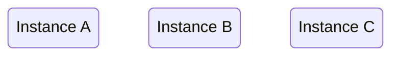
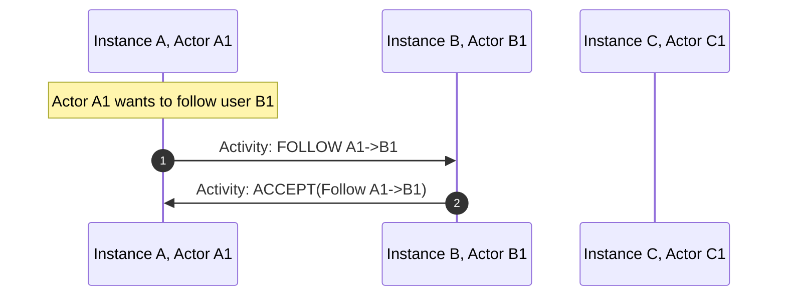
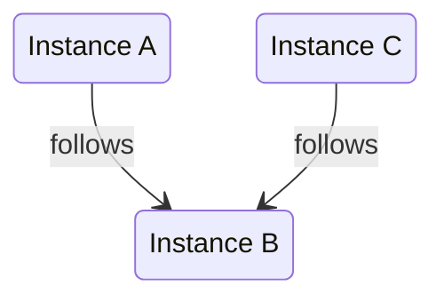
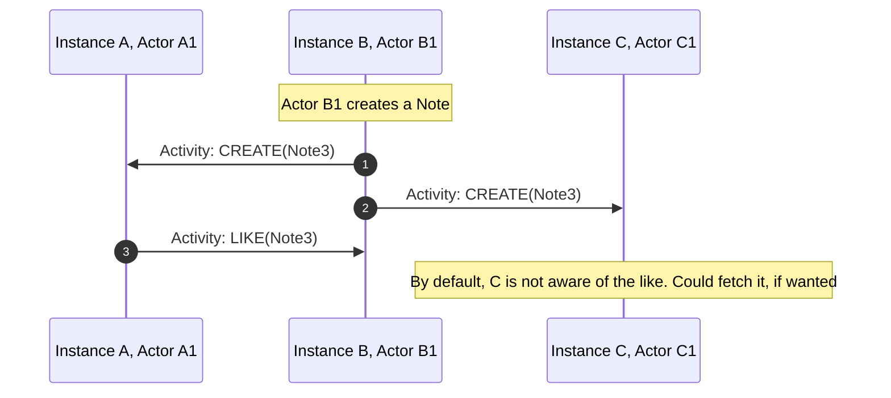
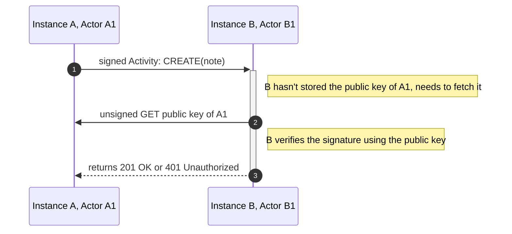

# Abusing ActivityPub to federate game servers

## A deeper look into what powers the Social Web.

<div class="absolute bottom-10">
  <span class="font-700">
   iu.tech 2024
  </span>
</div>


---
layout: image-right

image: /images/basti.png
---

# Who am I?
<br>

## Sebastian Di Luzio
- Senior Software Engineer <br>in Team Foundation (EduTech)
- Joined IU end of 2021
- Enjoy playing videogames a lot
- Spend far too much of my free time on side projects

---

# We will talk about

- The Fediverse
- Overview of the example game
- ActivityPub
  - General Overview
  - Deep Dive
- Making the game work with ActivityPub

---
layout: intro-image-right
image: /images/fediverse-logo.png
---

# The Fediverse


---
layout: image-right

image: /images/fediverse-v1.2.png
---

# What is the Fediverse aka. Social Web
- A giant Network of social media services.
- Platforms are independent but can interact using the ActivityPub protocol.
- Users can interact with any platform, need to join only a single one.

---

I thought to myself

# Huh, that sounds cool.

<div v-click>

# I want to build something based on this!
</div>


---

# The premise of the game

<v-clicks>

- Your task is to build up your village
- You need resources to build
- You can generate a specific resource set based on your occupation
  - e.g. a miner generates stone, coal, iron, etc.
- To progress you need resources you can't generate yourself
- You can trade with other players to get those resources

</v-clicks>
<div v-click>

## Through Federation ✨
</div>

---
layout: intro-image-right
image: /images/gameplay/0_resources.png
---
# You're a miner.
You generate stone, but no wood.

---
layout: intro-image-right
image: /images/gameplay/1_propose-treaty.png
---
# To start trading, you need to sign a treaty.
You can propose a treaty to a game server you trust.

---
layout: intro-image-right
image: /images/gameplay/2_accepted-treaty.png
---
# The other server accepted the treaty.
You allow connections to this server.

---
layout: intro-image-right
image: /images/gameplay/3_propose-trade.png
---
# You propose a trade.
You want wood and can give stone in return.

---
layout: intro-image-right
image: /images/gameplay/trade-meme.jpg
---

# On another server, they receive your offer.

---
layout: intro-image-right
image: /images/gameplay/6_received-trade-result.png
---
# They accept your offer.
You now have wood!


---

# Ok, we know the basics of the game
<br>

## How do we make this part of the Fediverse?

---

# First, we need to understand ActivityPub
<br>

## It's a W3C standard, finalized in 2018
> W3C is the World Wide Web Consortium
> 
> They define things like: HTML, CSS, XML, WebAssembly, WebRTC, ...

<br>

<v-click>

## It also:
- Defines an open federation protocol & behavior
- Defines a client-server API
- Defines federated server-to-server API
- Is based on ActivityStreams

</v-click>

---

# ActivityStreams (2.0)

- Also a W3C standard
- Specifies underlying schemata used in ActivityPub
- is implemented as JSON-LD

---

# JSON-LD

<br>

## JSON for Linking Data

- a W3C recommendation
- lightweight Linked Data format
<v-click>

## Linked Data
A way to create a network of standards-based, machine-readable data across Web sites
</v-click>

---

# To recap:

<v-click>

## JSON-LD
The technical format

</v-click>
<v-click>

## ActivityStreams
Schema of objects and data, Content-Type
</v-click>
<v-click>

## ActivityPub
The behavior of the server and the API it provides
</v-click>

---
layout: two-cols-header
---
# JSON-LD Example

::left::

Example JSON-LD object:


```json {|4-5|6-9|2-3}
{
  "@context": 
    "https://json-ld.org/contexts/person.jsonld",
  "@id": 
    "http://dbpedia.org/resource/John_Lennon",
  "name": "John Lennon",
  "born": "1940-10-09",
  "spouse": 
    "http://dbpedia.org/resource/Cynthia_Lennon"
}
```

::right::

<v-click at="3">

https://json-ld.org/contexts/person.jsonld:
```json {|5-15}
{
  "@context": {
      "Person": "http://xmlns.com/foaf/0.1/Person",
      "xsd": "http://www.w3.org/2001/XMLSchema#",
      "name": "http://xmlns.com/foaf/0.1/name",
      "born":
      {
         "@id": "http://schema.org/birthDate",
         "@type": "xsd:date"
      },
      "spouse":
      {
         "@id": "http://schema.org/spouse",
         "@type": "@id"
      },
   }
}
```

</v-click>


---

# ActivityStreams: Object

They are encompass almost everything that exists within ActivityStreams

- Activities
- Notes
- Actors
- Collections
- ...

---

# ActivityStreams: Activity


- Create
- Update
- Delete
- Follow
- Like
- Accept


```json
{
  "@context": "https://www.w3.org/ns/activitystreams",
  "id": "http://example.org/activities/1",
  "type": "Create",
  "actor": "http://example.org/actors/1",
  "object": "http://example.org/notes/1",
}
```

---

# ActivityStreams: Note

They are what you would call a "post" on a social media platform

```json
{
  "@context": "https://www.w3.org/ns/activitystreams",
  "id": "http://example.org/notes/1",
  "type": "Note",
  "content": "Hello world!",
  "attributedTo": "http://example.org/actors/1",
}
```

---

# ActivityStreams: Actor


- a "User"
- can be one per server, or many per server
- person, an organization, a bot, ...

```json
{
  "@context": "https://www.w3.org/ns/activitystreams",
  "id": "http://example.org/actors/1",
  "type": "Person",
  "name": "Basti",
  "preferredUsername": "XxBastixX",
  "inbox": "http://example.org/actors/1/inbox",
  "outbox": "http://example.org/actors/1/outbox",
}
```

---

# Inbox/Outbox

> Sounds like email? It's like email.


<br>

- Inbox: where activities are sent to
- Outbox: where activities can be retrieved from
- They are `OrderedCollection`s


---

# ActivityStreams: (Ordered) Collections

Outbox: 

```json
{
  "@context": "https://www.w3.org/ns/activitystreams",
  "summary": "Basti's activity feed",
  "type": "OrderedCollection",
  "totalItems": 2,
  "orderedItems": [
    {
      "id": "http://example.org/activity/42",
      "type": "Create",
      "object": "http://example.org/notes/7",
      ...
    },
    {
      "id": "http://example.org/activity/1",
      "type": "Create",
      "object": "http://example.org/notes/1",
      ...
    }
  ]
}
```

---

# Example: Three instances

<br>

They do not federate with eachother yet



---


# Example flow: Follow and Accept



---


# Example: Being followed by two instances

<br>



---

# Example: Note Creation & Like Federation



---

# Access Control/Ownership verification


HTTP signatures on most requests
  - GET outbox
  - POST to inbox

Every actor has a public key:

```json {|4,7-12}
{
  "@context": [
    "https://www.w3.org/ns/activitystreams",
    "https://w3id.org/security/v1",
  ],
  "id": "https://example.org/api/crossroads/actors/6ba7b810-9dad-11d1-80b4-00c04fd430c8",
  "publicKey": {
    "id": "https://example.org/api/crossroads/actors/6ba7b810-9dad-11d1-80b4-00c04fd430c8#main-key",
    "owner": "https://example.org/api/crossroads/actors/6ba7b810-9dad-11d1-80b4-00c04fd430c8",
    "publicKeyPem": "-----BEGIN PUBLIC KEY-----\nMIIBIjANBgkqhkiG9w0BAQEFAAOCAQ8AMIIBCgKCAQEAq4L85COLX4QJ1SRRITaT\n9ZGrUj3NWS42IS0RzCRZMvZnlmkMg8ktQFgM1lISRQJSEESHgQl+ZX+MVMByONSe\nPZCk4p0gCZ3euNQF1a2sRtBQHk8bbQj+7AlUx1/3kjkI1Q9bJYy2/DBZHTG8ZDU7
    \nFhly4CmGW3pGmCgFT4sGHFzLa5iG5n4Oxni3E/gOsKFt3fr4Z5W6vUjE5ReU8Bt+\n-----END PUBLIC KEY-----",
  },
  ...
}
```

---

# What to sign:

<v-clicks>

- target host
  - e.g. `example.org`
- target path
  - e.g. `/inbox`
- request method
  - e.g. `POST`
- date of request 
  - typically the signature is valid for 30s, mastodon e.g. allows 12h
  - e.g. `27 May 2024 12:00:00 GMT`
- If POST: a digest of the request body (SHA-256)
  - e.g. `{"text":"hello iu.tech"}` ➡ `SHA-256=1be0c0...d99e7`

</v-clicks>

---

# Flow of a signed request



---
layout: statement
---

# How do we make use of this protocol for a game?

<!-- 
Let's re-visit the game behavior and figure out how to map it to ActivityPub
-->

---

# Step 1: Sign a treaty with another instance

- Game servers have a single actor called `merchant`
- Proposing a treaty: follow
- Accepting a treaty: follow back
- Suspending a treaty: unfollow

<!-- 
- Every game server has a single actor called `merchant`
- To propose a treaty to an instance, you follow its actor
- Following back "signs" the treaty
- Any actor unfollowing suspends the treaty
- ActivityPub does not define a way to find actors
-->

---

# Finding instance actors: Webfinger

Is the de-facto standard for finding actors

<v-click>

GET `https://example.org/.well-known/webfinger?resource=acct:merchant@example.org`

```json
{
  "subject": "acct:merchant@example.org",
  "links": [
    {
      "rel": "self",
      "type": "application/activity+json",
      "href": "https://example.org/actors/6ba7b810-9dad-11d1-80b4-00c04fd430c8"
    },
    {
      "rel": "self",
      "type": "application/ld+json; profile=\"https://www.w3.org/ns/activitystreams\"",
      "href": "https://example.org/actors/6ba7b810-9dad-11d1-80b4-00c04fd430c8"
    }
  ]
}
```

</v-click>

---

# What about "normal" ActivityPub servers

We want to allow them to follow our activities, but don't really care about theirs

---
layout: statement
---

# ActivityPub is extendable


---

# ActivityPub context is extendable: Actor

````md magic-move
```json {|2-5}
{
  "@context": [
    "https://www.w3.org/ns/activitystreams",
    "https://w3id.org/security/v1",
  ],
  "id": "https://example.org/api/crossroads/actors/6ba7b810-9dad-11d1-80b4-00c04fd430c8",
  "type": "Actor",
  "preferredUsername": "Merchant",
  "inbox": "https://example.org/api/crossroads/inbox",
  "outbox": "https://example.org/api/crossroads/outbox",

  "publicKey": {
    "id": "https://example.org/api/crossroads/actors/6ba7b810-9dad-11d1-80b4-00c04fd430c8#main-key",
    "owner": "https://example.org/api/crossroads/actors/6ba7b810-9dad-11d1-80b4-00c04fd430c8",
    "publicKeyPem": "-----BEGIN PUBLIC KEY-----\nMIIBIjANBgkqhkiG9w0BAQEFAAOCAQ8AMIIBCgKCAQEAq4L85COLX4QJ1SRRITaT\n9ZGrUj3NWS42IS0RzCRZMvZnlmkMg8ktQFgM1lISRQJSEESHgQl+ZX+MVMByONSe\nPZCk4p0gCZ3euNQF1a2sRtBQHk8bbQj+7AlUx1/3kjkI1Q9bJYy2/DBZHTG8ZDU7
    \nFhly4CmGW3pGmCgFT4sGHFzLa5iG5n4Oxni3E/gOsKFt3fr4Z5W6vUjE5ReU8Bt+\n-----END PUBLIC KEY-----",
  },
  ...
}
```
```json {2-6}
{
  "@context": [
    "https://www.w3.org/ns/activitystreams",
    "https://w3id.org/security/v1",
    "https://github.com/maybeanerd/selfhosted-api-trader-game#isGameServer",
  ],
  "id": "https://example.org/api/crossroads/actors/6ba7b810-9dad-11d1-80b4-00c04fd430c8",
  "type": "Actor",
  "preferredUsername": "Merchant",
  "inbox": "https://example.org/api/crossroads/inbox",
  "outbox": "https://example.org/api/crossroads/outbox",

  "publicKey": {
    "id": "https://example.org/api/crossroads/actors/6ba7b810-9dad-11d1-80b4-00c04fd430c8#main-key",
    "owner": "https://example.org/api/crossroads/actors/6ba7b810-9dad-11d1-80b4-00c04fd430c8",
    "publicKeyPem": "-----BEGIN PUBLIC KEY-----\nMIIBIjANBgkqhkiG9w0BAQEFAAOCAQ8AMIIBCgKCAQEAq4L85COLX4QJ1SRRITaT\n9ZGrUj3NWS42IS0RzCRZMvZnlmkMg8ktQFgM1lISRQJSEESHgQl+ZX+MVMByONSe\nPZCk4p0gCZ3euNQF1a2sRtBQHk8bbQj+7AlUx1/3kjkI1Q9bJYy2/DBZHTG8ZDU7
    \nFhly4CmGW3pGmCgFT4sGHFzLa5iG5n4Oxni3E/gOsKFt3fr4Z5W6vUjE5ReU8Bt+\n-----END PUBLIC KEY-----",
  },
  ...
}
```
````

---

# We can detect game servers
And treat them differently from normal servers

- don't map their activities to game actions
- only allow following game servers

<!-- 
- Allow others to follow, but don't map those follows to treaties
- Ignore others likes in terms of accepted trades
- Ignore others notes/don't follow them to start with. Only follow game servers
-->

---

# Step 2: Trading

- Offer a trade
- Accept a trade we got
- Take back a trade we offered

<!-- 
- Creating a note to offer a trade
- Liking a note to accept a trade
- Deleting a note to cancel a trade
-->

---

# Trade content

How do we know what is being traded?

<!--  We can of course encode the trade content in the note, but that will look weird on other Fediverse instances.

 Can we make it both readable for other instances and usable for our game? -->

---


# ActivityPub context is extendable: Note

````md magic-move
```json {|2-4}
{
  "@context": [
    "https://www.w3.org/ns/activitystreams",
  ],
  "id": "https://example.org/api/crossroads/notes/123e4567-e89b-12d3-a456-426614174000",
  "type": "Note",
  "content": "One of our villagers requests 100 Wood and offers 50 Stone in return.",
  ...
}
```
```json {2-8}
{
  "@context": [
    "https://www.w3.org/ns/activitystreams",
    "https://github.com/maybeanerd/selfhosted-api-trader-game#isGameServer",
    {
      "gameContent": "https://github.com/maybeanerd/selfhosted-api-trader-game#gameContent"
    }
  ],
  "id": "https://example.org/api/crossroads/notes/123e4567-e89b-12d3-a456-426614174000",
  "type": "Note",
  "content": "One of our villagers requests 100 Wood and offers 50 Stone in return.",
  ...
}
```
```json {5-7,12-21|11-21}
{
  "@context": [
    "https://www.w3.org/ns/activitystreams",
    "https://github.com/maybeanerd/selfhosted-api-trader-game#isGameServer",
    {
      "gameContent": "https://github.com/maybeanerd/selfhosted-api-trader-game#gameContent"
    }
  ],
  "id": "https://example.org/api/crossroads/notes/123e4567-e89b-12d3-a456-426614174000",
  "type": "Note",
  "content": "One of our villagers requests 100 Wood and offers 50 Stone in return.",
  "gameContent": {
    "requestedResources": [{
        "type": "Wood",
        "amount": 100
      }],
    "offeredResources": [{
        "type": "Stone",
        "amount": 50
      }]
  },
  ...
}
```
````
---

# And with that, we are federated.

<!-- Other Services can follow our interactions, but we are selfcontained for game specific logic -->

---
layout: two-cols-header
---

# You can find me on the (social) web

::left::

#### <mdi-mastodon class="text-4" /> @maybeanerd@bumscode.com
#### <mdi-github class="text-4" /> maybeanerd
#### <mdi-web class="text-4" /> https://diluz.io
#### <mdi-linkedin class="text-4" /> sebastian-di-luzio

::right::

#### <mdi-email class="text-4" /> give-me-feedback-on-the-abusing-activity-pub-to-federate-game-servers-presentation-please@diluz.io
<br>

#### <mdi-email class="text-4" /> sebastian.di-luzio@iu.org