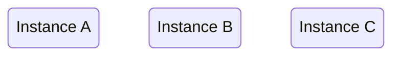
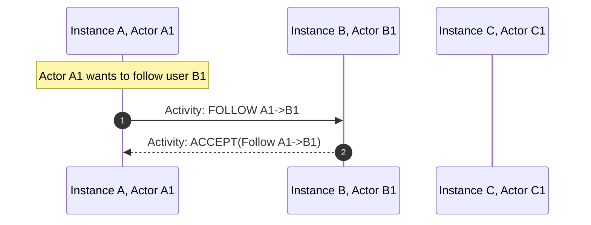
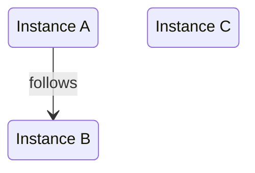
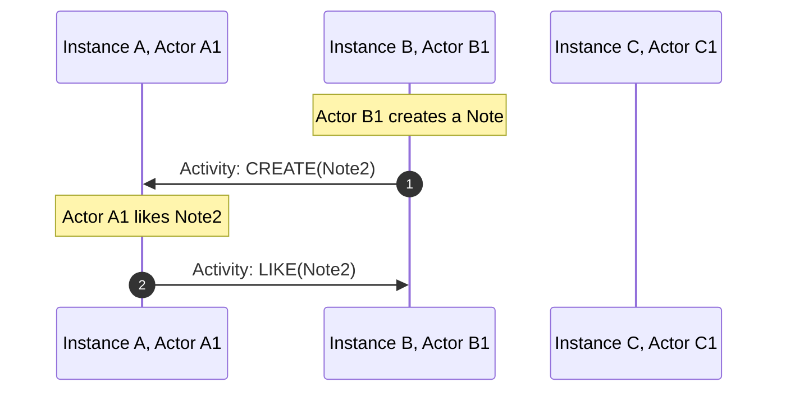
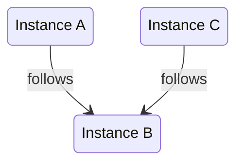
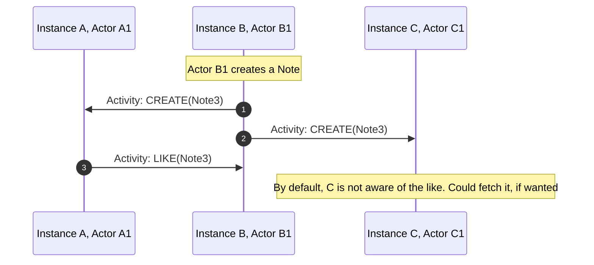
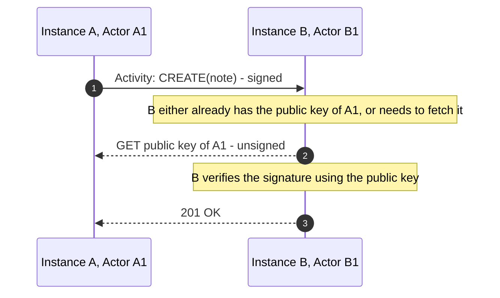

# Abusing ActivityPub to federate game servers

## A deeper look into what powers the Social Web.

<div class="absolute bottom-10">
  <span class="font-700">
   iu.tech 2024
  </span>
</div>

---


# Who am I?
<br>

## Sebastian Di Luzio
- Senior Software Engineer @ Team Foundation, EduTech
- Enjoy playing videogames a lot
- Spend far too much of my free time on side projects

---
layout: intro-image-right
image: /images/fediverse-logo.png
---

# The Fediverse


---
layout: image-right

image: /images/fediverse-v1.2.png
---

# What is the Fediverse aka. Social Web
- A giant Network of social media services.
- Platforms are independent but can interact using the ActivityPub protocol.
- Users interact with any platform using a single account.

---

# What do game servers have to do with this?

## Federation of Mastodon inspired this game.
How cool would it be if people hosted their own game servers and they could play with their friends from other servers?

## What's this game about

- It's more about playing around with interesting tech than building a game that is successful.
- It's also about getting tech savvy people to think about the social web
- I want people to build their own clients, and I want to see what they come up with.
- A small group of people cooperating on a shared goal.

---

# Gameplay TLDR
- Idle, Base Building, Coop Multiplayer
- You are a villager in a small village
- Your task is to build up your village
- You need resources to build
- You can generate a specific resource set based on your occupation
- You can trade resources with other players, and will need to do so to progress

---


# where game


## Model all game server interactions through ActivityPub
- offer a trade of resources
  - sending a trade offer to another server
  - accepting a trade offer from another server
- signing a treaty with another server
  - this is the active opt-in to allow trade with another server


---

# Signing a Treaty

- follow to propose a treaty
  - always accept on protocol level
- follow back to sign the treaty
- whenever someone unfollows, the treaty is broken

---


# Trading


- create a note to propose a trade
  - include readable description
  - include game information (resources, amounts)
- like a note to accept a trade
- delete the note to cancel a trade or mark it as completed for others

---

## I asked myself

# What if someone on Mastodon could follow my gameserver and get updates on what's happening in the game?

It's really not necessary for the gameplay.

But it would be cool.

Also, we like open standards, don't we?

---

# Whats this ActivityPub thing?
<br>

## It's a W3C standard, finalized in 2018
> W3C is the World Wide Web Consortium
> 
> They define things like: HTML, CSS, XML, WebAssembly, WebRTC, ...

<br>

<v-click>

## It's also:
- Open, decentralized social networking protocol
- Defines a client-server API
- Defines federated server-to-server API
- based on ActivityStreams

</v-click>

---

# ActivityStreams (2.0)

- Also a W3C standard
- Specifies underlying schemata used in ActivityPub
- is implemented as JSON-LD

---

# JSON-LD

<br>

## JSON for Linking Data

- a W3C recommendation
- lightweight Linked Data format
<v-click>

## Linked Data
A way to create a network of standards-based, machine-readable data across Web sites
</v-click>


---
layout: two-cols-header
---
# JSON-LD Example

::left::

Example JSON-LD object:


```json {|4-5|6-9|2-3}
{
  "@context": 
    "https://json-ld.org/contexts/person.jsonld",
  "@id": 
    "http://dbpedia.org/resource/John_Lennon",
  "name": "John Lennon",
  "born": "1940-10-09",
  "spouse": 
    "http://dbpedia.org/resource/Cynthia_Lennon"
}
```

::right::

<v-click at="3">

https://json-ld.org/contexts/person.jsonld:
```json {|5-15}
{
  "@context": {
      "Person": "http://xmlns.com/foaf/0.1/Person",
      "xsd": "http://www.w3.org/2001/XMLSchema#",
      "name": "http://xmlns.com/foaf/0.1/name",
      "born":
      {
         "@id": "http://schema.org/birthDate",
         "@type": "xsd:date"
      },
      "spouse":
      {
         "@id": "http://schema.org/spouse",
         "@type": "@id"
      },
   }
}
```

</v-click>

---

# ActivityStreams: Object

They are encompass almost everything that exists within ActivityStreams

- Activities
- Notes
- Actors
- Collections
- ...

---

# ActivityStreams: Activity


- Create
- Update
- Delete
- Follow
- Like
- Accept


```json
{
  "@context": "https://www.w3.org/ns/activitystreams",
  "id": "http://example.org/activities/1",
  "type": "Create",
  "actor": "http://example.org/actors/1",
  "object": "http://example.org/notes/1",
}
```

---

# ActivityStreams: Note

They are what you would call a "post" on a social media platform

```json
{
  "@context": "https://www.w3.org/ns/activitystreams",
  "id": "http://example.org/notes/1",
  "type": "Note",
  "content": "Hello world!",
  "attributedTo": "http://example.org/actors/1",
}
```

---

# ActivityStreams: Actor


- a "User"
- can be one per server, or many per server
- person, an organization, a bot, ...

```json
{
  "@context": "https://www.w3.org/ns/activitystreams",
  "id": "http://example.org/actors/1",
  "type": "Person",
  "name": "Basti",
  "preferredUsername": "XxBastixX",
  "inbox": "http://example.org/actors/1/inbox",
  "outbox": "http://example.org/actors/1/outbox",
}
```

---

# Inbox/Outbox

Sounds like email? It's like email.

- Inbox: where activities are sent to
- Outbox: where activities can be retrieved from
- They are `OrderedCollection`s


---

# ActivityStreams: (Ordered) Collections

Outbox: 

```json
{
  "@context": "https://www.w3.org/ns/activitystreams",
  "summary": "Basti's activity feed",
  "type": "OrderedCollection",
  "totalItems": 2,
  "orderedItems": [
    {
      "id": "http://example.org/activity/1",
      "type": "Create",
      "object": "http://example.org/notes/1",
      ...
    },
    {
      "id": "http://example.org/notes/1",
      "type": "Note",
      "name": "Hello world!",
      ...
    }
  ]
}
```

---

# This is what a basic setup could look like
They do not federate with eachother yet



---


# Example flow: How to follow



---


# Turns into
### The Federation after previous examples


---

# Example flow: Liking a note



---


# What if we have two following instances



---

# Liking a note with two followers



---

# Access Control/Ownership verification


HTTP signatures on most requests
  - GET outbox
  - POST to inbox

Every actor has a public key:

```json
{
  "@context": [
    "https://www.w3.org/ns/activitystreams",
    "https://w3id.org/security/v1",
  ],
  "id": "https://example.org/api/crossroads/actors/6ba7b810-9dad-11d1-80b4-00c04fd430c8",
  "publicKey": {
    "id": "https://example.org/api/crossroads/actors/6ba7b810-9dad-11d1-80b4-00c04fd430c8#main-key",
    "owner": "https://example.org/api/crossroads/actors/6ba7b810-9dad-11d1-80b4-00c04fd430c8",
    "publicKeyPem": "-----BEGIN PUBLIC KEY-----\nMIIBIjANBgkqhkiG9w0BAQEFAAOCAQ8AMIIBCgKCAQEAq4L85COLX4QJ1SRRITaT\n9ZGrUj3NWS42IS0RzCRZMvZnlmkMg8ktQFgM1lISRQJSEESHgQl+ZX+MVMByONSe\nPZCk4p0gCZ3euNQF1a2sRtBQHk8bbQj+7AlUx1/3kjkI1Q9bJYy2/DBZHTG8ZDU7
    \nFhly4CmGW3pGmCgFT4sGHFzLa5iG5n4Oxni3E/gOsKFt3fr4Z5W6vUjE5ReU8Bt+\n-----END PUBLIC KEY-----",
  },
  ...
}
```

---

# What to sign:
- target host
- target path
- request method
- date of request (typically the signature is valid for 30s)
- If POST: a digest of the request body (SHA-256)
  
---

# TL;DR on how a signature is created
 
````md magic-move
```ts
const requestType = 'POST';
const target = '/inbox';
const host = 'example.org';
const date = '27 May 2024 12:00:00 GMT';
const bodyDigest = 'SHA-256=...';
```
```ts
const requestType = 'POST';
const target = '/inbox';
const host = 'example.org';
const date = '27 May 2024 12:00:00 GMT';
const bodyDigest = 'SHA-256=...';

const stringToSign = `(request-target): ${target} \nhost: ${host} \ndate: ${date}\ndigest: ${bodyDigest}`;
```
```ts
const requestType = 'POST';
const target = '/inbox';
const host = 'example.org';
const date = '27 May 2024 12:00:00 GMT';
const bodyDigest = 'SHA-256=...';

const stringToSign = `(request-target): ${target} \nhost: ${host} \ndate: ${date}\ndigest: ${bodyDigest}`;
const actorId = 'abcdefg';
const signature = sign(stringToSign, getPrivateKey(actorId));
```
```ts {|8,11|7,12|9,13}
const requestType = 'POST';
const target = '/inbox';
const host = 'example.org';
const date = '27 May 2024 12:00:00 GMT';
const bodyDigest = 'SHA-256=...';

const stringToSign = `(request-target): ${target} \nhost: ${host} \ndate: ${date}\ndigest: ${bodyDigest}`;
const actorId = 'abcdefg';
const signature = sign(stringToSign, getPrivateKey(actorId));
const signatureHeader = 
`keyId="https://example.com/actor/${actorId}#main-key",
headers="(request-target) host date digest",
signature="${signature}"`;
```
```ts
const requestType = 'POST';
const target = '/inbox';
const host = 'example.org';
const date = '27 May 2024 12:00:00 GMT';
const bodyDigest = 'SHA-256=...';

const stringToSign = `(request-target): ${target} \nhost: ${host} \ndate: ${date}\ndigest: ${bodyDigest}`;
const actorId = 'abcdefg';
const signature = sign(stringToSign, getPrivateKey(actorId));
const signatureHeader = 
`keyId="https://example.com/actor/${actorId}#main-key",
headers="(request-target) host date digest",
signature="${signature}"`;

await fetch(target, host, {
  type: requestType,
  headers: {
    Signature: signatureHeader,
    Date: date,
    Host: host,
    Digest: bodyDigest
  },
  data: body,
})
```
````

---

# Flow of a signed request



---

# How do we make use of this protocol for a game?

- We aren't really building a social media platform
- We need custom information for game servers that other ActivityPub servers don't need, or won't understand

---
layout: statement
---
# ActivityPub is extendable


---


# ActivityPub context is extendable: Actor

````md magic-move
```json {|2-5}
{
  "@context": [
    "https://www.w3.org/ns/activitystreams",
    "https://w3id.org/security/v1",
  ],
  "id": "https://example.org/api/crossroads/actors/6ba7b810-9dad-11d1-80b4-00c04fd430c8",
  "type": "Actor",
  "preferredUsername": "Merchant",
  "inbox": "https://example.org/api/crossroads/inbox",
  "outbox": "https://example.org/api/crossroads/outbox",

  "publicKey": {
    "id": "https://example.org/api/crossroads/actors/6ba7b810-9dad-11d1-80b4-00c04fd430c8#main-key",
    "owner": "https://example.org/api/crossroads/actors/6ba7b810-9dad-11d1-80b4-00c04fd430c8",
    "publicKeyPem": "-----BEGIN PUBLIC KEY-----\nMIIBIjANBgkqhkiG9w0BAQEFAAOCAQ8AMIIBCgKCAQEAq4L85COLX4QJ1SRRITaT\n9ZGrUj3NWS42IS0RzCRZMvZnlmkMg8ktQFgM1lISRQJSEESHgQl+ZX+MVMByONSe\nPZCk4p0gCZ3euNQF1a2sRtBQHk8bbQj+7AlUx1/3kjkI1Q9bJYy2/DBZHTG8ZDU7
    \nFhly4CmGW3pGmCgFT4sGHFzLa5iG5n4Oxni3E/gOsKFt3fr4Z5W6vUjE5ReU8Bt+\n-----END PUBLIC KEY-----",
  },
  ...
}
```
```json {2-6}
{
  "@context": [
    "https://www.w3.org/ns/activitystreams",
    "https://w3id.org/security/v1",
    "https://github.com/maybeanerd/selfhosted-api-trader-game#isGameServer",
  ],
  "id": "https://example.org/api/crossroads/actors/6ba7b810-9dad-11d1-80b4-00c04fd430c8",
  "type": "Actor",
  "preferredUsername": "Merchant",
  "inbox": "https://example.org/api/crossroads/inbox",
  "outbox": "https://example.org/api/crossroads/outbox",

  "publicKey": {
    "id": "https://example.org/api/crossroads/actors/6ba7b810-9dad-11d1-80b4-00c04fd430c8#main-key",
    "owner": "https://example.org/api/crossroads/actors/6ba7b810-9dad-11d1-80b4-00c04fd430c8",
    "publicKeyPem": "-----BEGIN PUBLIC KEY-----\nMIIBIjANBgkqhkiG9w0BAQEFAAOCAQ8AMIIBCgKCAQEAq4L85COLX4QJ1SRRITaT\n9ZGrUj3NWS42IS0RzCRZMvZnlmkMg8ktQFgM1lISRQJSEESHgQl+ZX+MVMByONSe\nPZCk4p0gCZ3euNQF1a2sRtBQHk8bbQj+7AlUx1/3kjkI1Q9bJYy2/DBZHTG8ZDU7
    \nFhly4CmGW3pGmCgFT4sGHFzLa5iG5n4Oxni3E/gOsKFt3fr4Z5W6vUjE5ReU8Bt+\n-----END PUBLIC KEY-----",
  },
  ...
}
```
````
---


# ActivityPub context is extendable: Note

````md magic-move
```json {|2-4}
{
  "@context": [
    "https://www.w3.org/ns/activitystreams",
  ],
  "id": "https://example.org/api/crossroads/notes/123e4567-e89b-12d3-a456-426614174000",
  "type": "Note",
  "content": "One of our villagers requests 100 Wood and offers 50 Stone in return.",
  ...
}
```
```json {2-8}
{
  "@context": [
    "https://www.w3.org/ns/activitystreams",
    "https://github.com/maybeanerd/selfhosted-api-trader-game#isGameServer",
    {
      "gameContent": "https://github.com/maybeanerd/selfhosted-api-trader-game#gameContent"
    }
  ],
  "id": "https://example.org/api/crossroads/notes/123e4567-e89b-12d3-a456-426614174000",
  "type": "Note",
  "content": "One of our villagers requests 100 Wood and offers 50 Stone in return.",
  ...
}
```
```json {5-7,12-21|11-21}
{
  "@context": [
    "https://www.w3.org/ns/activitystreams",
    "https://github.com/maybeanerd/selfhosted-api-trader-game#isGameServer",
    {
      "gameContent": "https://github.com/maybeanerd/selfhosted-api-trader-game#gameContent"
    }
  ],
  "id": "https://example.org/api/crossroads/notes/123e4567-e89b-12d3-a456-426614174000",
  "type": "Note",
  "content": "One of our villagers requests 100 Wood and offers 50 Stone in return.",
  "gameContent": {
    "requestedResources": [{
        "type": "Wood",
        "amount": 100
      }],
    "offeredResources": [{
        "type": "Stone",
        "amount": 50
      }]
  },
  ...
}
```
````

---
layout: two-cols-header
---

# Follow me for more

::left::

#### <mdi-mastodon class="text-4" /> @maybeanerd@bumscode.com
#### <mdi-github class="text-4" /> maybeanerd
#### <mdi-web class="text-4" /> diluz.io/sebastian
#### <mdi-linkedin class="text-4" /> sebastian-di-luzio

::right::

#### <mdi-email class="text-4" /> give-me-feedback-on-the-abusing-activity-pub-to-federate-game-servers-presentation-please@diluz.io