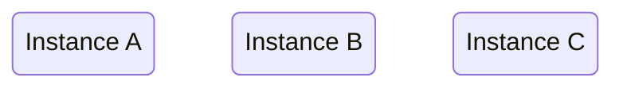
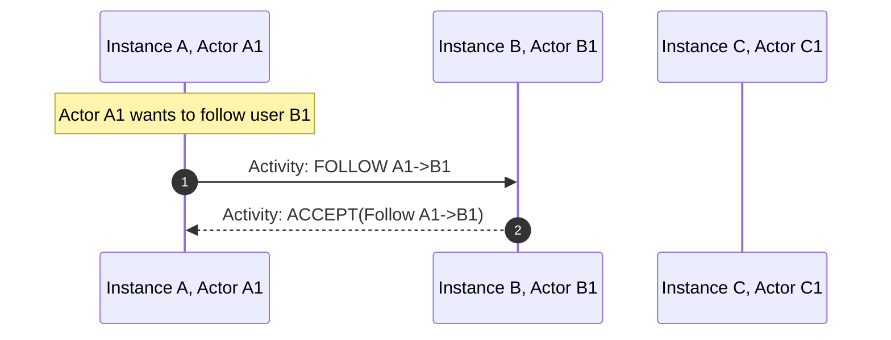
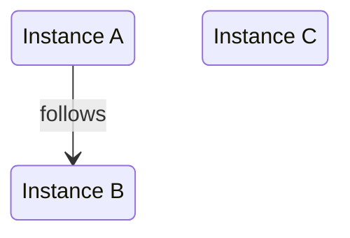
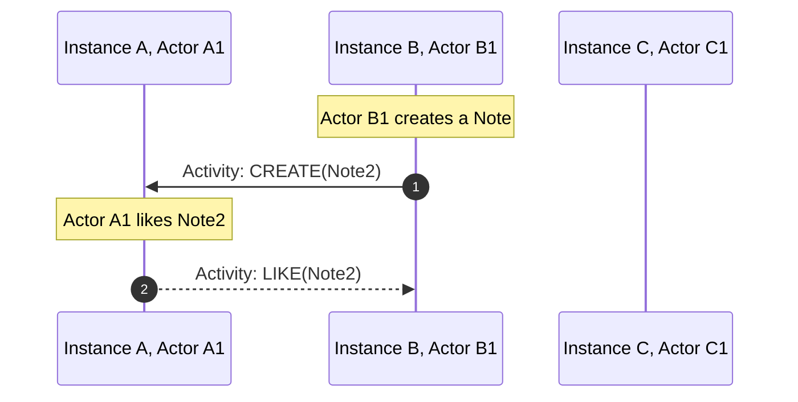
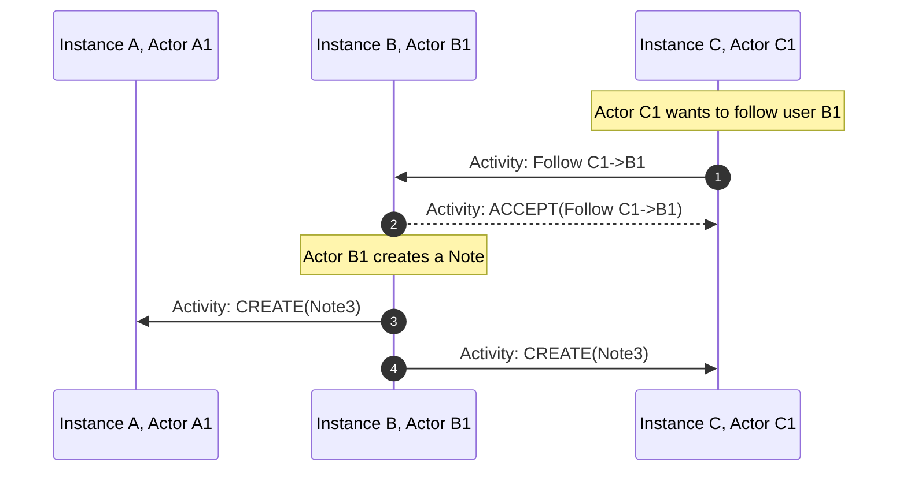
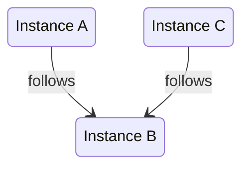

# Abusing ActivityPub to federate game servers

## A deeper look into what powers the Social Web.

<div class="absolute bottom-10">
  <span class="font-700">
   iu.tech 2024
  </span>
</div>

---

# Who am I?

### Sebastian Di Luzio
- Senior Software Engineer @ Team Foundation, Edutech
- Enjoy playing videogames a lot
- Spend far too much of my free time on side projects

---
layout: image-right

image: /images/fediverse-logo.png
---

# What's this social web, or Fediverse?
- The Fediverse is a giant Network of social media services.
- There are platforms for microblogging, blogging, photoblogging, videohosting and much more and they are all interconnected, or federated.
- You only need one account to follow users on any of the platforms.
- Services in the Fediverse interact with each other using the ActivityPub protocol.


---
layout: image-right

image: /images/fedidb-software-distribution.png
---

# An alternative to centralized social media
<br>

## <mdi-mastodon class="text-6" /> Mastodon

- A microblogging platform
- Open source
- Became widely popular when Elon Musk took over Twitter
- The largest piece of software in the Fediverse
- 7.000.000+ users

---

# What do game servers have to do with this?

## Federation of Mastodon inspired this game.
How cool would it be if people hosted their own game servers and they could play with their friends from other servers?

## What's this game about

- It's more about playing around with interesting tech than building a game that is successful.
- It's also about getting tech savvy people to think about the social web
- I want people to build their own clients, and I want to see what they come up with.
- A small group of people cooperating on a shared goal.

---

# Gameplay TLDR
- Idle, Base Building, Coop Multiplayer
- You are a villager in a small village
- Your task is to build up your village
- You need resources to build
- You can generate a specific resource set based on your occupation
- You can trade resources with other players, and will need to do so to progress

---

# Original Federation
- Last year I built a simple federation system that worked
- Essentially, it was a simple push/pull system based on standardized events shared over REST
- It worked!
- It was boring and highly specific to this game

---

### I asked myself

# What if someone on Mastodon could follow my gameserver and get updates on what's happening in the game?

### It's really not necessary for the gameplay.

But it would be cool.

---

# Whats this ActivityPub thing?

- ActivityPub is an open, decentralized social networking protocol based on ActivityStreams and JSON-LD
- It provides a client/server API for managing content, as well as a federated server-to-server API for delivering notifications and content
- It's a W3C standard finalized in 2018
  - If you don't know who they are, they are the people who define: HTML, CSS, XML, WebAssembly, WebRTC, SOAP, and many more
- It's what powers the Fediverse


---

# ActivityStreams (2.0)

- Also a W3C standard
- Specifies underlying schemata used in ActivityPub
- Includes things like: Object, Actor, Activity, Collection, Link
- is implemented as serialized JSON-LD


---

# JSON-LD

JSON for Linking Data

JSON-LD is a lightweight Linked Data format.


---
layout: two-cols-header
---
::left::
Example JSON-LD object:
```json
{
  "@context": 
    "https://json-ld.org/contexts/person.jsonld",
  "@id": 
    "http://dbpedia.org/resource/John_Lennon",
  "name": "John Lennon",
  "born": "1940-10-09",
  "spouse": 
    "http://dbpedia.org/resource/Cynthia_Lennon"
}
```
::right::

https://json-ld.org/contexts/person.jsonld:

```json
{
  "@context": {
      "Person": "http://xmlns.com/foaf/0.1/Person",
      "xsd": "http://www.w3.org/2001/XMLSchema#",
      "name": "http://xmlns.com/foaf/0.1/name",
      "born":
      {
         "@id": "http://schema.org/birthDate",
         "@type": "xsd:date"
      },
      "spouse":
      {
         "@id": "http://schema.org/spouse",
         "@type": "@id"
      },
   }
}
```


---

# ActivityPub

### Uses ActivityStreams 2.0 for

- Objects
- Activities
- Actors
- Collections


---

# Objects

### Most things in ActivityPub are an Object

- any Activity
- a Note
  - It's a "post"
- an Actor
- a Collection
- everything else, essentially


---

# Activities


- Create
- Update
- Delete
- Follow
- Like
- Accept
- ...


---

# Actor


- Representation of a "User"
- can be one per server, or many per server
- can be a person, an organization, a bot, ...
- is the author/owner of activities and objects
- has an inbox and outbox

---

# Inbox/Outbox

Sounds like email? It's like email.

- Inbox: where activities are sent to
- Outbox: where activities can be retrieved from
- They are `OrderedCollection`s


---

# (Ordered) Collections


```json
{
  "@context": "https://www.w3.org/ns/activitystreams",
  "summary": "Sally's notes",
  "type": "OrderedCollection",
  "totalItems": 2,
  "orderedItems": [
    {
      "type": "Note",
      "name": "A Simple Note"
    },
    {
      "type": "Note",
      "name": "Another Simple Note"
    }
  ]
}
```

---

# GIVE ME EXAMPLE
okay okay
### This is what a basic setup could look like
They do not federate with eachother yet



---


# Example flow: How to follow



---


# Turns into
### The Federation after previous examples


---

# Example flow: Liking a note


---

# Example flow: Getting a second follower



---


# Turns into
### The Federation after previous examples



---


# where game


## Model all game server interactions through ActivityPub
- offer a trade of resources
  - sending a trade offer to another server
  - accepting a trade offer from another server
- signing a treaty with another server
  - this is the active opt-in to allow trade with another server


---

# Signing a Treaty


This sounds awfully similar to a Follow activity

- follow to propose a treaty
  - always accept on protocol level
- follow back to sign the treaty
- whenever someone unfollows, the treaty is broken

---


# Trading


- create a note to propose a trade
  - include readable description
  - include game information (resources, amounts)
- like a note to accept a trade
- delete the note to cancel a trade or mark it as completed for others

---


# ActivityPub context is extensible: Actor

````md magic-move
```json {|2-5}
{
  "@context": [
    "https://www.w3.org/ns/activitystreams",
    "https://w3id.org/security/v1",
  ],
  "id": "https://test.game.diluz.io/api/crossroads/actors/6ba7b810-9dad-11d1-80b4-00c04fd430c8",
  "type": "Actor",
  "preferredUsername": "Merchant",
  "inbox": "https://test.game.diluz.io/api/crossroads/inbox",
  "outbox": "https://test.game.diluz.io/api/crossroads/outbox",

  "publicKey": {
    "id": "https://test.game.diluz.io/api/crossroads/actors/6ba7b810-9dad-11d1-80b4-00c04fd430c8#main-key",
    "owner": "https://test.game.diluz.io/api/crossroads/actors/6ba7b810-9dad-11d1-80b4-00c04fd430c8",
    "publicKeyPem": "-----BEGIN PUBLIC KEY-----\nMIIBIjANBgkqhkiG9w0BAQEFAAOCAQ8AMIIBCgKCAQEAq4L85COLX4QJ1SRRITaT\n9ZGrUj3NWS42IS0RzCRZMvZnlmkMg8ktQFgM1lISRQJSEESHgQl+ZX+MVMByONSe\nPZCk4p0gCZ3euNQF1a2sRtBQHk8bbQj+7AlUx1/3kjkI1Q9bJYy2/DBZHTG8ZDU7
    \nFhly4CmGW3pGmCgFT4sGHFzLa5iG5n4Oxni3E/gOsKFt3fr4Z5W6vUjE5ReU8Bt+\n-----END PUBLIC KEY-----",
  },
  ...
}
```
```json {2-6}
{
  "@context": [
    "https://www.w3.org/ns/activitystreams",
    "https://w3id.org/security/v1",
    "https://github.com/maybeanerd/selfhosted-api-trader-game#isGameServer",
  ],
  "id": "https://test.game.diluz.io/api/crossroads/actors/6ba7b810-9dad-11d1-80b4-00c04fd430c8",
  "type": "Actor",
  "preferredUsername": "Merchant",
  "inbox": "https://test.game.diluz.io/api/crossroads/inbox",
  "outbox": "https://test.game.diluz.io/api/crossroads/outbox",

  "publicKey": {
    "id": "https://test.game.diluz.io/api/crossroads/actors/6ba7b810-9dad-11d1-80b4-00c04fd430c8#main-key",
    "owner": "https://test.game.diluz.io/api/crossroads/actors/6ba7b810-9dad-11d1-80b4-00c04fd430c8",
    "publicKeyPem": "-----BEGIN PUBLIC KEY-----\nMIIBIjANBgkqhkiG9w0BAQEFAAOCAQ8AMIIBCgKCAQEAq4L85COLX4QJ1SRRITaT\n9ZGrUj3NWS42IS0RzCRZMvZnlmkMg8ktQFgM1lISRQJSEESHgQl+ZX+MVMByONSe\nPZCk4p0gCZ3euNQF1a2sRtBQHk8bbQj+7AlUx1/3kjkI1Q9bJYy2/DBZHTG8ZDU7
    \nFhly4CmGW3pGmCgFT4sGHFzLa5iG5n4Oxni3E/gOsKFt3fr4Z5W6vUjE5ReU8Bt+\n-----END PUBLIC KEY-----",
  },
  ...
}
```
````
---


# ActivityPub context is extensible: Note

````md magic-move
```json {|2-4}
{
  "@context": [
    "https://www.w3.org/ns/activitystreams",
  ],
  "id": "https://test.game.diluz.io/api/crossroads/notes/123e4567-e89b-12d3-a456-426614174000",
  "type": "Note",
  "content": "One of our villagers requests 100 Wood and offers 50 Stone in return.",
  ...
}
```
```json {2-8}
{
  "@context": [
    "https://www.w3.org/ns/activitystreams",
    "https://github.com/maybeanerd/selfhosted-api-trader-game#isGameServer",
    {
      "gameContent": "https://github.com/maybeanerd/selfhosted-api-trader-game#gameContent"
    }
  ],
  "id": "https://test.game.diluz.io/api/crossroads/notes/123e4567-e89b-12d3-a456-426614174000",
  "type": "Note",
  "content": "One of our villagers requests 100 Wood and offers 50 Stone in return.",
  ...
}
```
```json {5-7,12-21|11-21}
{
  "@context": [
    "https://www.w3.org/ns/activitystreams",
    "https://github.com/maybeanerd/selfhosted-api-trader-game#isGameServer",
    {
      "gameContent": "https://github.com/maybeanerd/selfhosted-api-trader-game#gameContent"
    }
  ],
  "id": "https://test.game.diluz.io/api/crossroads/notes/123e4567-e89b-12d3-a456-426614174000",
  "type": "Note",
  "content": "One of our villagers requests 100 Wood and offers 50 Stone in return.",
  "gameContent": {
    "requestedResources": [{
        "type": "Wood",
        "amount": 100
      }],
    "offeredResources": [{
        "type": "Stone",
        "amount": 50
      }]
  },
  ...
}
```
````

---

# header


content


---

# Access Control/Ownership verification


HTTP signatures on most requests
  - GET outbox
  - POST to inbox

Every actor has a public key:

```json
{
  "@context": [
    "https://www.w3.org/ns/activitystreams",
    "https://w3id.org/security/v1",
  ],
  "id": "https://test.game.diluz.io/api/crossroads/actors/6ba7b810-9dad-11d1-80b4-00c04fd430c8",
  "publicKey": {
    "id": "https://test.game.diluz.io/api/crossroads/actors/6ba7b810-9dad-11d1-80b4-00c04fd430c8#main-key",
    "owner": "https://test.game.diluz.io/api/crossroads/actors/6ba7b810-9dad-11d1-80b4-00c04fd430c8",
    "publicKeyPem": "-----BEGIN PUBLIC KEY-----\nMIIBIjANBgkqhkiG9w0BAQEFAAOCAQ8AMIIBCgKCAQEAq4L85COLX4QJ1SRRITaT\n9ZGrUj3NWS42IS0RzCRZMvZnlmkMg8ktQFgM1lISRQJSEESHgQl+ZX+MVMByONSe\nPZCk4p0gCZ3euNQF1a2sRtBQHk8bbQj+7AlUx1/3kjkI1Q9bJYy2/DBZHTG8ZDU7
    \nFhly4CmGW3pGmCgFT4sGHFzLa5iG5n4Oxni3E/gOsKFt3fr4Z5W6vUjE5ReU8Bt+\n-----END PUBLIC KEY-----",
  },
  ...
}
```

---

# What to sign:
- target host
- target path
- request method
- date of request (typically the signature is valid for 30s)
- If POST: a digest of the request body (SHA-256)
  
---

# TL;DR on how a signature is created
 
````md magic-move
```ts
const requestType = `POST`;
const target = `/inbox`;
const host = `test.game.diluz.io`;
const date = `27 May 2024 12:00:00 GMT`;
const bodyDigest = `SHA-256=...`;
```
```ts
const requestType = `POST`;
const target = `/inbox`;
const host = `test.game.diluz.io`;
const date = `27 May 2024 12:00:00 GMT`;
const bodyDigest = `SHA-256=...`;

const stringToSign = `(request-target): ${target} \nhost: ${host} \ndate: ${date}\ndigest: ${bodyDigest}`;
```
```ts
const requestType = `POST`;
const target = `/inbox`;
const host = `test.game.diluz.io`;
const date = `27 May 2024 12:00:00 GMT`;
const bodyDigest = `SHA-256=...`;

const stringToSign = `(request-target): ${target} \nhost: ${host} \ndate: ${date}\ndigest: ${bodyDigest}`;
const signature = sign(stringToSign, getPrivateKey('abcdefg'));
```
```ts {|7,11|8,10}
const requestType = `POST`;
const target = `/inbox`;
const host = `test.game.diluz.io`;
const date = `27 May 2024 12:00:00 GMT`;
const bodyDigest = `SHA-256=...`;

const stringToSign = `(request-target): ${target} \nhost: ${host} \ndate: ${date}\ndigest: ${bodyDigest}`;
const signature = sign(stringToSign, getPrivateKey('abcdefg'));
const signatureHeader = 
`keyId="https://mydomain.com/actor/abcdefg#main-key",
headers="(request-target) host date digest",signature="${signature}"`;
```
```ts
const requestType = `POST`;
const target = `/inbox`;
const host = `test.game.diluz.io`;
const date = `27 May 2024 12:00:00 GMT`;
const bodyDigest = `SHA-256=...`;

const stringToSign = `(request-target): ${target} \nhost: ${host} \ndate: ${date}\ndigest: ${bodyDigest}`;
const signature = sign(stringToSign, getPrivateKey('abcdefg'));
const signatureHeader = 
`keyId="https://mydomain.com/actor/abcdefg#main-key",
headers="(request-target) host date digest",signature="${signature}"`;

await fetch(target, host, {
  type: requestType,
  headers: {
    Signature: signatureHeader,
    Date: date,
    Host: host,
    Digest: bodyDigest
  },
  data: body,
})
```
````

---
layout: two-cols-header
---

# Follow me for more

::left::

#### <mdi-mastodon class="text-4" /> @maybeanerd@bumscode.com
#### <mdi-github class="text-4" /> maybeanerd
#### <mdi-web class="text-4" /> diluz.io/sebastian
#### <mdi-linkedin class="text-4" /> sebastian-di-luzio

::right::

#### <mdi-email class="text-4" /> give-me-feedback-on-the-abusing-activity-pub-to-federate-game-servers-presentation-please@diluz.io